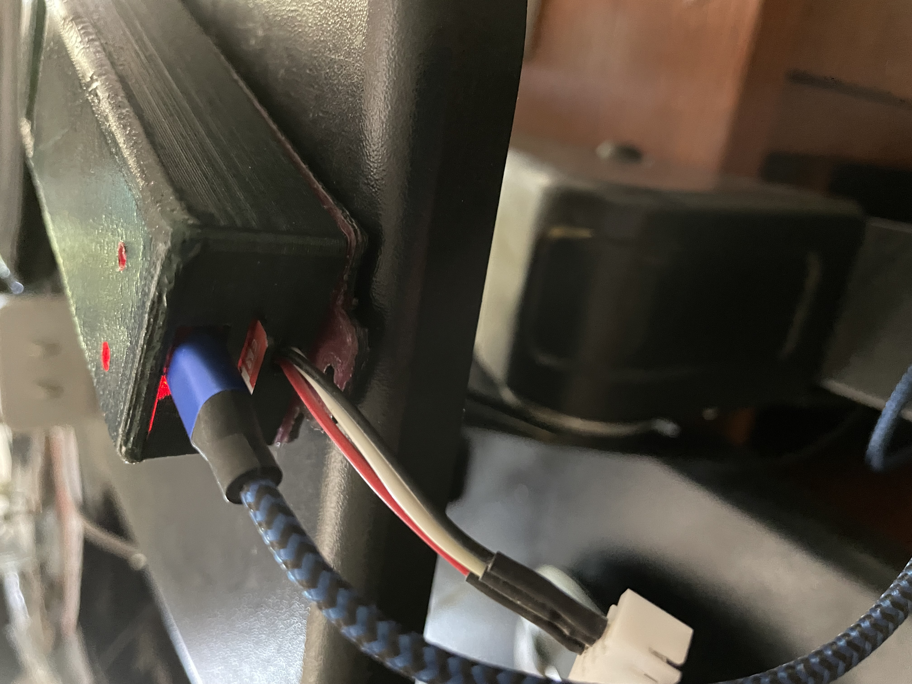

**Wireless Well Pressure Monitor**

This App uses an ESP32C3, a water pressure sensor, and a small 1.3" OLED display for the hardware. Water pressure from a well is wirelessly transmitted to a local internet address where it is displayed in chart form. The data for each day is stored in a micro SD card. The history for these days can be shown in another chart. There is zoom and pan capability.

Highcharts.com provides the JavaScript library for the chart graphics and rendering.

There is a **Configuration Page** where the name of the location can be set. Also, there is a **Zone Table** that can be created, edited, and then saved in a micro SD card in the ESP32C3. Zone Tables can also be created as text JSON files and compiled into SPIFFS along with the rest of the code. From the Config Page, the JSON zone table can then be loaded and saved in SD, where it is used to detect and display which zone is running and flag any deviations from the average PSI. Deviations from average should indicate if there are broken or leaking irrigation components and are shown in red in the charts.

Each day starts at 6:00 A.M. till 5:59 A.M. (24 hours) the next day. Each day's data is stored in the micro SD card.

On the **Config Page**, the pressure sample rate can be changed from the default 30 sec. A sample rate >= 60 sec has not been tested and may result in aliasing since many factors are determined on a minute basis. 

The pressure sensor can be calibrated to the actual pressure if there is a gauge that shows a deviation between them.

There is a **Files Page** that provides a way to inspect all the SD and SPIFFS files and to delete them if desired. You can also remotely reset the ESP32C3 processor here.

**ElegantOTA** is used to wirelessly update the code. A 3D-printed case is used to house the electronics.

**Author: Richard Benear 9/22/23**

* Notes:

  Red plot points indicate that the pressure is outside the average PSI by +/- 2 PSI. When transitioning between zones, there will naturally be a few points that are red until the pressure stabilizes.

  In the pictures, the gradually descending pressure is due to a leak in the system. Once the pressure reaches about 41 PSI, the pump turns on and fills the pressure tank until the pressure is 61 PSI and then it will turn off.

  In some pictures, the zones may be changing but the pressure is not changing with the zones. This is because the controller is turned off. Seome red plot points occur when the leaking water pressure happens to fall outside the average PSI range for that zone.
  

